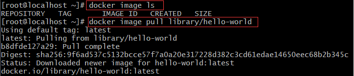

## 2021/7/8学习内容

- Docker的基本使用

  - 首先了解了image 文件、容器文件
  - 使用Dockerfile文件配置images

- Docker安装Redis和Nginx

  - 通过docker pull拉取Redis和Nginx的镜像
  - docker images查看本地Redis和Nginx的镜像
  - 最后测试是否安装成功

- 学习了Docker和Linux的一些基本命令

  - 对Redis和Nginx的安装，基本认识了一些Docker的命令。比如查看、删除image和容器文件

  - 使用Dockerfile文件的创建，简单了解了目录的创建(mkdir )、查看(ls)、切换(cd)等命令

- 最后想自己动手做一个Dockerfile构建镜像（失败，不知道怎么将项目jar包导入Linux中，也不知道怎么创建Dockerfile文件）

## 1. Docker学习

   - image 文件：Docker 把应用程序及其依赖，打包在 image 文件里面。只有通过这个文件，才能生成 Docker 容器。
   >```（）bash
   ># 列出本机的所有 image 文件。
   >$ docker image ls
   ># 将抓取 image 文件从仓库抓取到本地（案例：Hello World）
   >$ docker image pull library/hello-world（方式一）
   >$ docker image pull hello-world（方式二）
   >```

 

  

   >```bash
   ># 查看 image文件
   >$ docker image ls
   ># 运行这个文件
   >$ docker container run hello-world
   ># 删除 image 文件（该处没截图，删除之后再查看就没有了）
   >$ docker image rm [imageName]
   >```

   

   - 容器文件：image 文件生成的容器实例，本身也是一个文件，称为容器文件。也就是说，一旦容器生成，就会同时存在两个文件： image 文件和容器文件。

   >```bash
   ># 列出本机正在运行的容器
   >$ docker container ls
   ># 列出本机所有容器，包括终止运行的容器
   >$ docker container ls --all
   >```

   

     >```bash
     ># 删除容器文件
     >$ docker container rm [containerID]
     >#再用列出所有容器查看
     >$ docker container ls --all
     >```

   

   - Dockerfile 文件：它是一个文本文件，用来配置 image。

## 2. Docker安装Redis

   - 第一步：查看可用的 Redis 版本。[访问 Redis 镜像库地址](https://hub.docker.com/_/redis?tab=tags。)

   - 第二步：或取最新版的 Redis 镜像

   >```bash
   ># 拉取官方的最新版本的镜像
   >$ docker pull redis:latest
   >```

   
   - 第三步：查看本地镜像

   >```bash
   >$ docker images
   >```

   - 第四步：运行容器

   >```bash
   >#运行 redis 容器
   >$ docker run -itd --name redis-test -p 6379:6379 redis
   >```

   - 第五步：安装成功

   >```bash
   ># 查看容器的运行信息
   >$ docker ps
   >#  redis-cli 连接测试使用 redis 服务
   >$ docker exec -it redis-test /bin/bash
   >```


## 3.Docker安装Nginx

- 第一步：查看可用的 Nginx 版本
- 第二步：或取最新版的 Nginx 镜像

   >```bash
   >$ docker pull nginx:latest
   >```
- 第三步：查看本地镜像

   >```bash
   >$ docker images
   >```
- 第四步：运行容器
   >```bash
   ># --name nginx-test：容器名称。
   ># -p 8080:80： 端口进行映射，将本地 8080 端口映射到容器内部的 80 端口。
   ># -d nginx： 设置容器在在后台一直运行。
   >$ docker run --name nginx-test -p 8080:80 -d nginx
   >```
- 第五步：安装成功


第六步：进入容器命令: docker exec -it nginx-test /bin/bash


注：

1、xshell上，从windows上传文件到centos7命令：rz -bye， 从centos7 下载文件到windows命令： sz xxx.yy

2、centos7 需要安装 yum install lrzsz -y  ,才能使用rz和sz命令